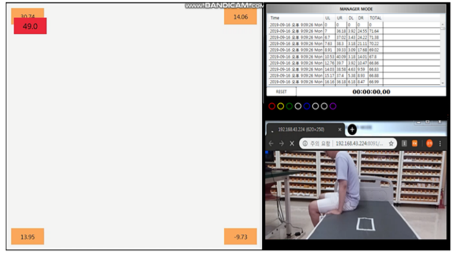
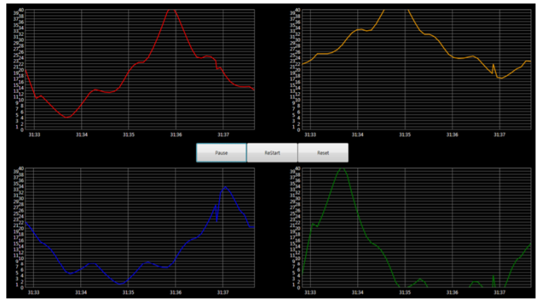

# Falling_Bedsore_Program
>학부생 3학년 2학기 때 낙창 및 욕창 방지 프로그램

## Installation

Windows10:

Visual Studio2019로 실행함

## Usage example

 * fallbed ver1.0.0 : 환자를 위한 낙상알림 및 욕창판단 프로그램
 
 다른 팀이 개발했던 프로그램을 의미함
 
 * fallbed ver1.1.0 : 낙상 및 욕창 판단을 위한 분석용 프로그램
 ver1.0.0로부터 불필요한 기능 삭제, 필요한 기능 추가

 삭제 
 - 아날로드미터 
 - 회원가입/로그인
 - 환자별침대관리
 
 추가
 - 영상출력모드 : 라즈베리파이 카메라를 이용한 실시간 스트리밍을 하는 웹 페이지 출력
 - 로드셀차트모드 : 네 개의 무게값에 대한 차트를 그림
 - 체중차트모드 : 체중에 대한 차트를 그림
 - 무게중심차트모드 : 무게중심에 대한 차트를 그림

 * fallbed ver1.1.1은 초당 들어오는 데이터 개수 조정, 조건에 따른 DB저장, 일정 이상 움직임이 감지되면 그 때의 환자 자세를 촬영하는 기능 추가 예정

## Development setup

.Net Framework 4.7.2 사용함

## Release History

* 1.1.1
    * second
    * Atmega 코드 추가

* 1.1.1
    * first
    * 개발 완료

## Meta

김준혁 – wnsgur1198@naver.com

[https://github.com/wnsgur1198/Korean_history-TOEIC-reminder]

## Contributing

1. Fork it (<https://github.com/yourname/yourproject/fork>)
2. Create your feature branch (`git checkout -b feature/fooBar`)
3. Commit your changes (`git commit -am 'Add some fooBar'`)
4. Push to the branch (`git push origin feature/fooBar`)
5. Create a new Pull Request

<!-- Markdown link & img dfn's -->
